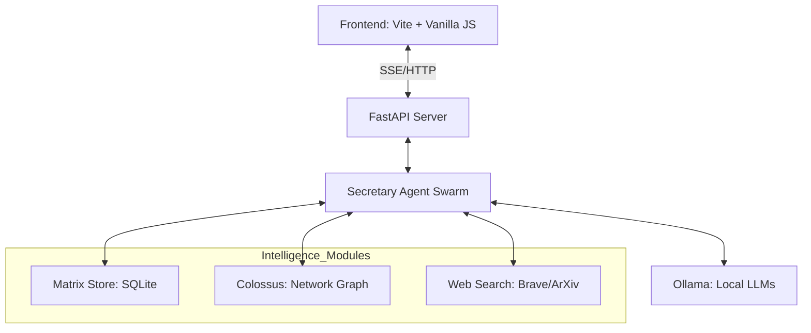

# ICEBURG: Multi-Agent Research Platform

**Local-first AI research system powered by Ollama with multi-agent deliberation and high-fidelity intelligence mapping.**

Built for [katanx.com](https://www.katanx.com) - a self-development platform for practitioners of "The Nine Arts."

## What Works Now ✅

ICEBURG currently provides:

- **Secretary Agent**: Fast conversational AI using local Ollama models (llama3.1:8b, qwen2.5, etc.)
- **Multi-Agent Research Protocol**: Surveyor → Dissident → Synthesist → Oracle for deep analysis.
- **Web Frontend**: Mobile-first UI with real-time SSE streaming (http://localhost:3000).
- **Conversation Memory**: Context-aware retrieval and hallucination detection.
- **Knowledge Base**: 302-entry Celestial Encyclopedia on bioelectricity & consciousness.
- **Metacognition**: Self-correction and contradiction detection (v3.4).

### 🚀 Advanced Intelligence (Pegasus/Colossus/Scholar)
- **Pegasus Information Architecture**: High-fidelity network visualization extension for exploring complex entity relationships.
- **Colossus Intelligence Platform**: Specialized backend tier providing unified graph/SQLite search for deep investigative research.
- **ICEBURG Scholar**: Internal research metadata index and 🎓 academic search interface with automated styled report rendering.

## Quick Start

### Prerequisites
- **Ollama** installed ([ollama.com](https://ollama.com))
- **Python 3.9+**
- **Node.js 18+**

### Running ICEBURG

```bash
# Start the system (backend + frontend)
./scripts/start_iceburg.sh

# Access the system: http://localhost:3000
```

## Usage Examples

### Chat Mode (Fast)
Ask simple questions, get direct answers:
```
User: What is consciousness?
ICEBURG: [Provides philosophical answer with sources]
```

### Research Mode (Deep)
Generate multi-agent analysis:
```
User: Analyze the connection between quantum mechanics and bioelectricity
ICEBURG: [Generates comprehensive multi-perspective report with Surveyor/Dissident/Synthesist/Oracle]
```

Example research outputs: [`data/research_outputs/`](data/research_outputs/)

## Architecture & Search Strategy

ICEBURG uses a multi-layered search strategy to ensure maximum grounding:

- **Semantic Search**: Vector indexing (ChromaDB) for conceptually related retrieval.
- **Lexical Search (Matrix Store)**: Direct SQLite search over 1.5M+ entities (Sanctions, PEP, etc.).
- **Relationship Analysis (Colossus)**: High-performance graph traversal for mapping global networks.
- **Web Extraction**: Real-time integration with Brave Search, DuckDuckGo, and arXiv.



## Project Structure

```text
iceburg/
├── src/iceburg/           # Core Python package
│   ├── agents/            # Specialized reasoning agents (Secretary, Swarm)
│   ├── api/               # FastAPI endpoints & management
│   ├── colossus/          # Graph & Matrix intelligence layer (Extension)
│   ├── matrix/            # Data ingestion, scraping & resolution
│   ├── memory/            # Unified memory & ChromaDB indexing
│   └── tools/             # OSINT, Web Search, PDF toolsets
├── frontend/              # Web application
│   ├── app.html           # Main research console
│   ├── scholar.html       # Scholarly search interface
│   ├── render_report.html # Academic report renderer
│   └── pegasus.html       # Network discovery visualization
├── docs/                  # System documentation
│   ├── architecture/      # System design & diagrams
│   ├── reports/           # Strategic analysis & audit reports
│   └── guides/            # Developer & onboarding guides
├── data/                  # Local datasets & vector stores
├── scripts/               # Automation & deployment scripts
└── tests/                 # Comprehensive test suites
```

## Documentation

- **[Current State](CURRENT_STATE.md)** - What's operational vs planned
- **[Full Documentation Index](docs/INDEX.md)** - Complete docs organized by category
- **[Changelog](CHANGELOG.md)** - Version history and recent updates
- **[Contributing](CONTRIBUTING.md)** - How to contribute

## Configuration

Main configuration file: `config/iceburg_unified.yaml`

Key settings:
- `default_mode`: "chat" (fast) or "research" (deep)
- `primary_model`: Ollama model to use (default: "llama3.1:8b")
- `enable_memory`: Enable conversation history

## For katanx.com Integration

ICEBURG powers the research capabilities for [katanx.com](https://www.katanx.com)'s self-development platform:

- **Multi-perspective research**: Generate insights from multiple viewpoints
- **Evidence tracking**: Track sources and detect contradictions
- **Suppression detection**: Identify patterns in suppressed research
- **Cross-domain synthesis**: Connect ideas across "The Nine Arts"

## Development Status

## Documentation

### Quick Start Guides
- **[AI_CONSTITUTION.md](AI_CONSTITUTION.md)** - 🤖 AI Assistant quick reference for instant system understanding
- **[FEATURES_INVENTORY.md](FEATURES_INVENTORY.md)** - 📋 Complete catalog of all 150+ system capabilities
- **[README.md](README.md)** - Project overview and quick start

### Detailed Documentation
- **[src/iceburg/research/TRANSDUCTION_INDEX.md](src/iceburg/research/TRANSDUCTION_INDEX.md)** - ⚡ **Persistent index for Transduction & Device Generation research**
- **[docs/architecture/](docs/architecture/)** - Complete system architecture
- **[docs/COMPLETE_FEATURE_REFERENCE.md](docs/COMPLETE_FEATURE_REFERENCE.md)** - All features with technical details
- **[docs/INDEX.md](docs/INDEX.md)** - Documentation index
- **[CHANGELOG.md](CHANGELOG.md)** - Version history

### For AI Assistants
> **Start here**: Read [AI_CONSTITUTION.md](AI_CONSTITUTION.md) first for instant system comprehension. It reduces context requirements from 679+ lines to ~400 lines of essential information.

---

**License**: Proprietary  
**Maintained By**: Praxis Research & Engineering Inc.  
**Contact**: Jackson M. Danger Signal (Principal Investigator)
**Version**: 3.4.0  
**Status**: Chat & Research features operational  
**Last Updated**: December 23, 2025

### Recent Updates (v3.4.0)
- ✅ **Metacognition**: Integrated semantic alignment & contradiction detection
- ✅ **Safety**: Added Quarantine System for flagged outputs
- ✅ **Documentation**: 100% feature coverage in [COMPLETE_FEATURE_REFERENCE.md](docs/COMPLETE_FEATURE_REFERENCE.md)

See [CHANGELOG.md](CHANGELOG.md) for detailed history.

## Roadmap

See [docs/planning/ROADMAP_TO_10_OUT_OF_10.md](docs/planning/ROADMAP_TO_10_OUT_OF_10.md) for future plans.

**Priorities:**
1. Improve conversation memory reliability
2. Enhanced multi-agent coordination
3. Better error handling and resilience
4. Performance optimizations

## Contributing

We welcome contributions! See [CONTRIBUTING.md](CONTRIBUTING.md) for guidelines.

Quick start:
1. Fork the repository
2. Create a feature branch
3. Make your changes
4. Add tests
5. Submit a pull request

## License

MIT License - see [LICENSE](LICENSE) for details.

## Support

- **Documentation**: [docs/INDEX.md](docs/INDEX.md)
- **Issues**: [GitHub Issues](https://github.com/your-org/iceburg/issues)
- **Discussions**: [GitHub Discussions](https://github.com/your-org/iceburg/discussions)

---

**Built with ❤️ for truth-seekers and practitioners of The Nine Arts.**# Study page rendering fixes deployed
