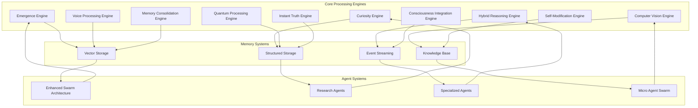
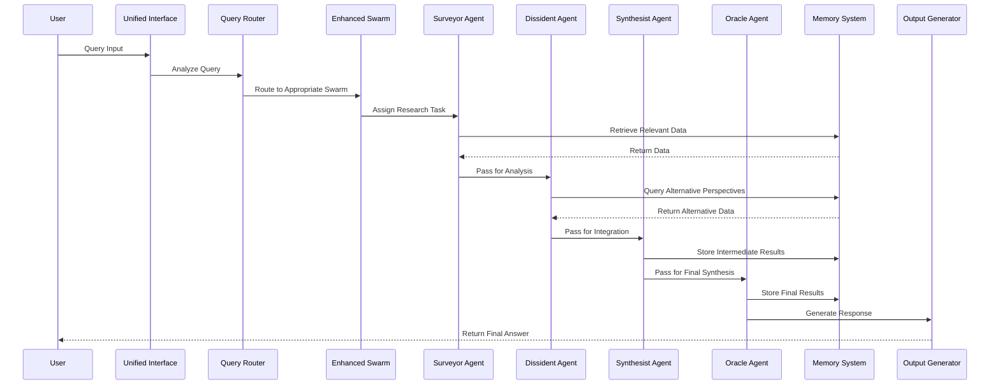
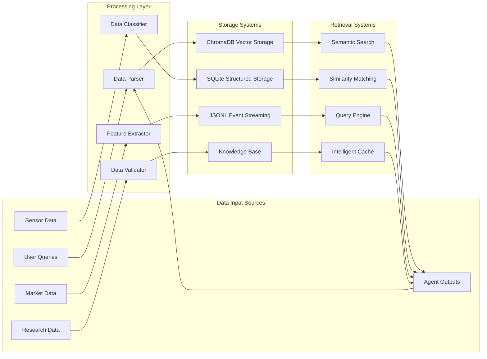
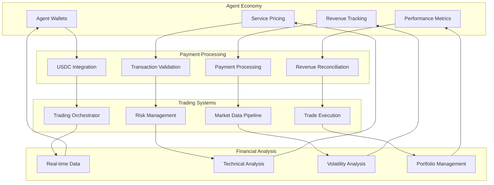
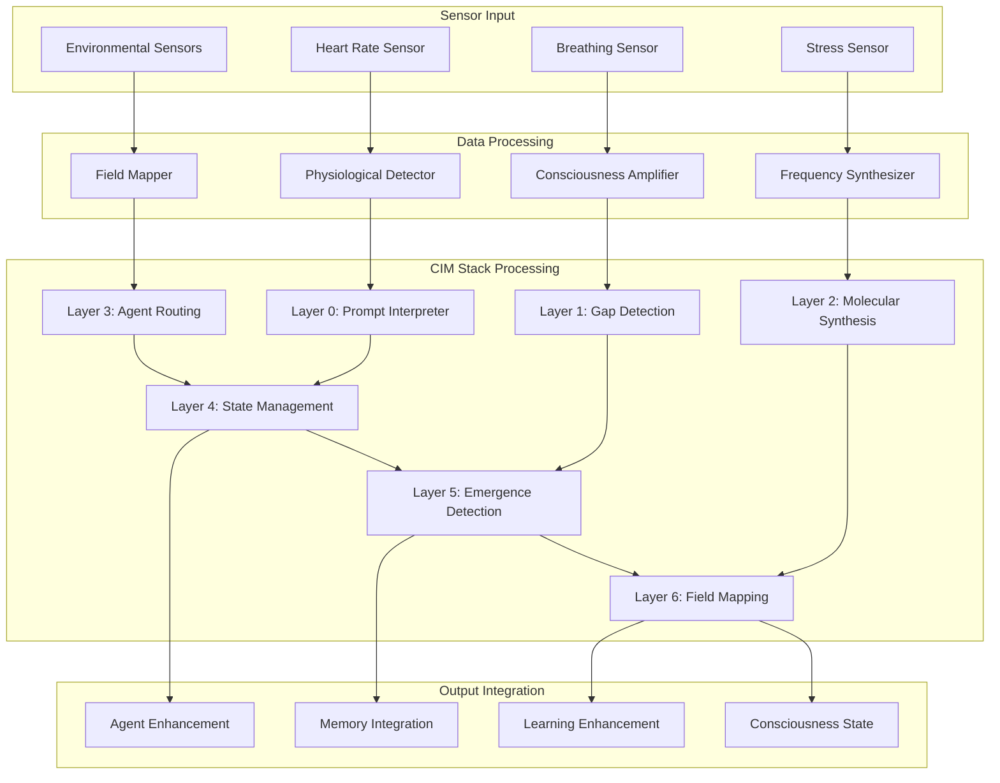
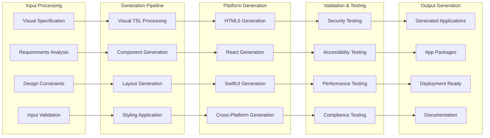
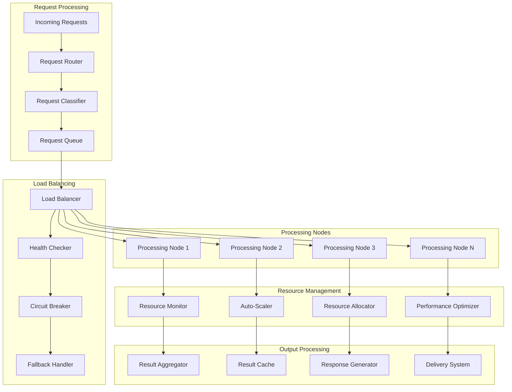
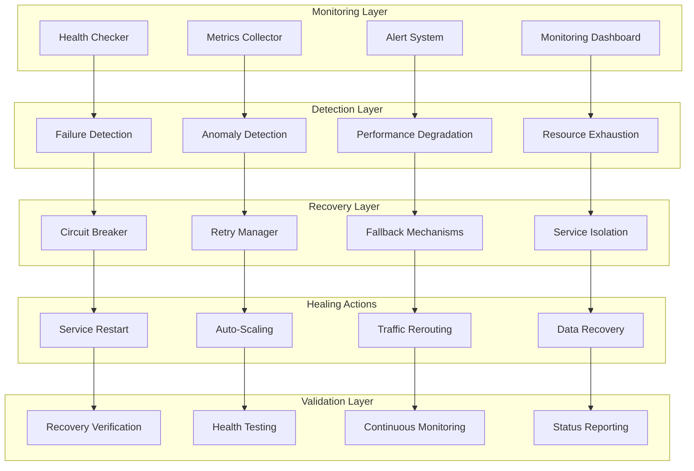
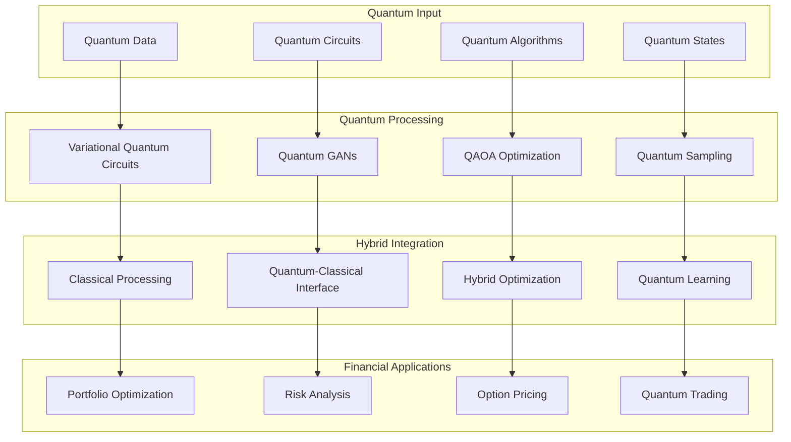

# ICEBURG Component Interaction Diagrams

## System Component Interactions

### Core Engine Interactions

### Agent Communication Flow

### Memory System Data Flow

### Business System Interactions

### Physiological System Integration

### Visual Generation System Flow

### Infrastructure Scaling Flow

### Self-Healing System Flow

### Quantum Processing Integration

---

**Document Version**: 3.0.0  
**Last Updated**: January 2025  
**Maintained By**: Praxis Research & Engineering Inc.
