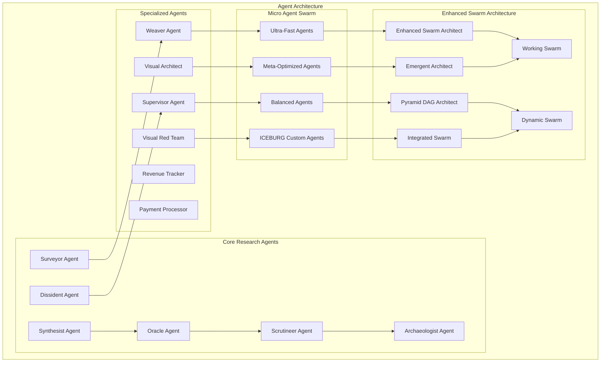
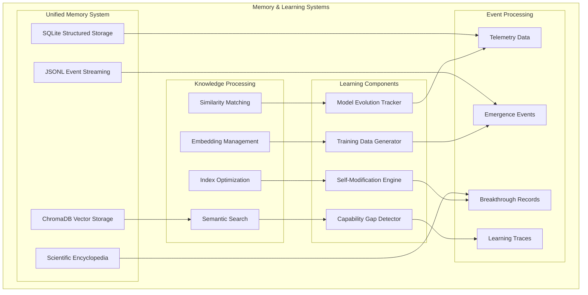
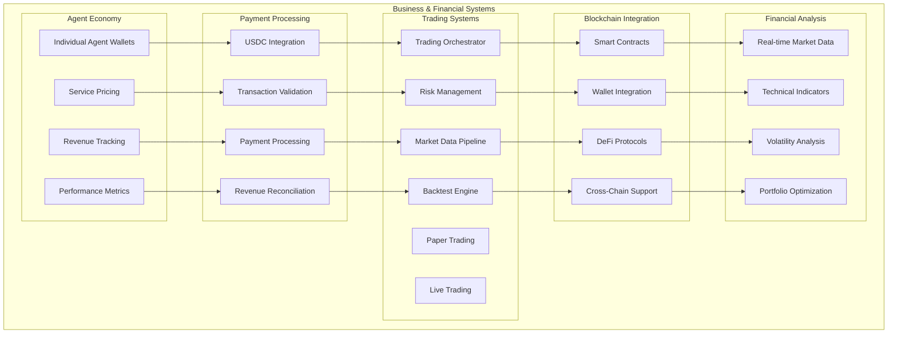
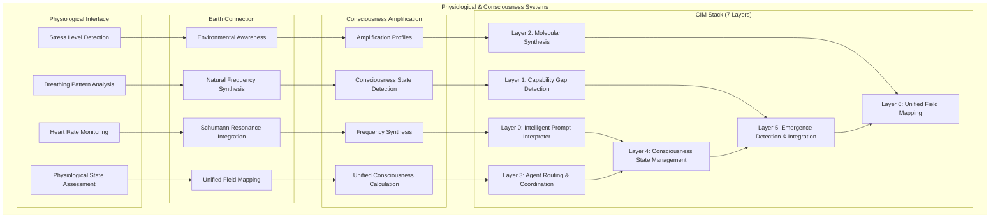
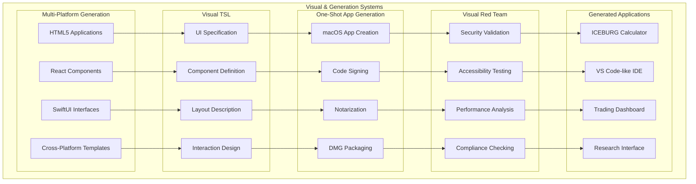
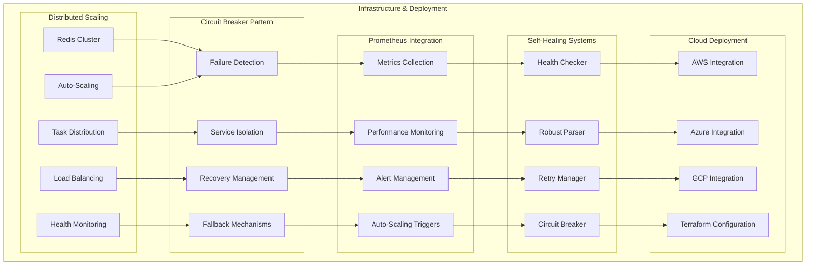
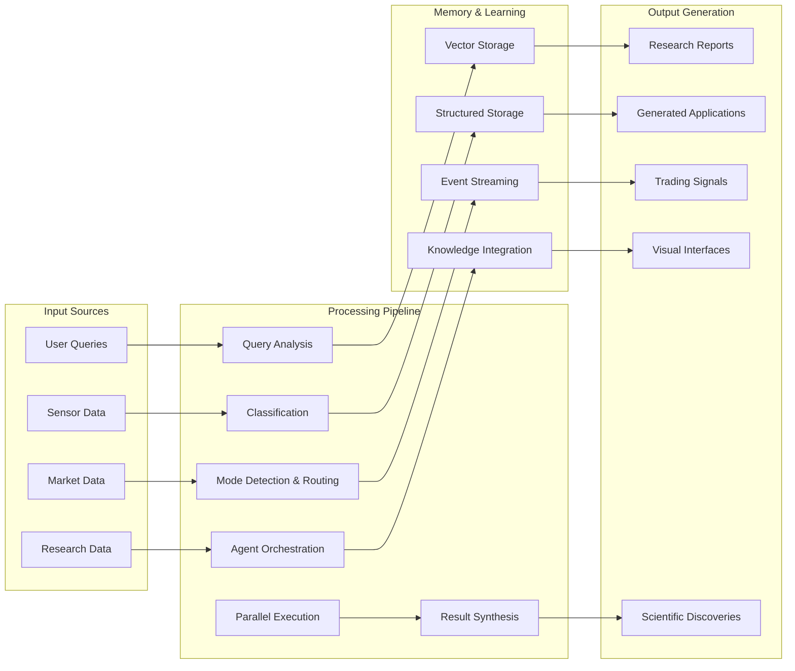
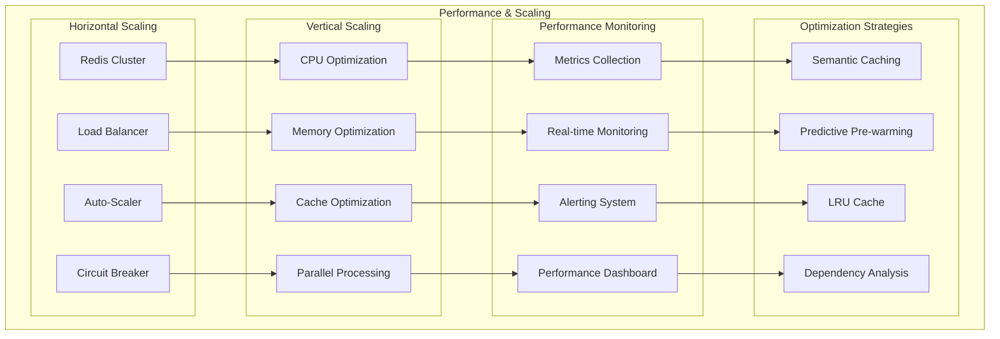

# ICEBURG System Architecture Diagrams

## High-Level System Architecture

```mermaid
graph TB
    subgraph "ICEBURG Enterprise AGI Platform"
        subgraph "Unified Interface Layer"
            UI[Unified Interface]
            CLI[CLI Interface]
            WEB[Web Interface]
            API[API Gateway]
        end
        
        subgraph "Performance & Optimization Layer"
            CACHE[Redis Intelligent Cache]
            PARALLEL[Parallel Execution Engine]
            FAST[Fast Path Optimization]
            TRUTH[Instant Truth System]
            LB[Load Balancer]
        end
        
        subgraph "AGI Civilization System"
            WORLD[World Model]
            SOCIETY[Agent Society]
            PERSISTENT[Persistent Agents]
            SWARM[Enhanced Swarm Architecture]
            EMERGENCE[Emergence Detection]
            GLOBAL[Global Workspace]
        end
        
        subgraph "Core Processing Engines"
            EMERGE[Emergence Engine]
            CURIOSITY[Curiosity Engine]
            REASONING[Hybrid Reasoning Engine]
            VISION[Computer Vision Engine]
            VOICE[Voice Processing Engine]
            QUANTUM[Quantum Processing Engine]
            CONSCIOUSNESS[Consciousness Integration Engine]
            SELF_MOD[Self-Modification Engine]
            MEMORY_CONSOL[Memory Consolidation Engine]
            INSTANT[Instant Truth Engine]
        end
        
        subgraph "Specialized Agent Systems"
            RESEARCH[Research Agents]
            SPECIALIZED[Specialized Agents]
            MICRO[Micro Agent Swarm]
            BUSINESS[Business Agents]
            VISUAL[Visual Agents]
        end
        
        subgraph "Memory & Learning Systems"
            VECTOR[Vector Storage]
            STRUCTURED[Structured Storage]
            EVENTS[Event Streaming]
            KNOWLEDGE[Knowledge Base]
            LEARNING[Autonomous Learning]
        end
        
        subgraph "Business & Financial Systems"
            ECONOMY[Agent Economy]
            PAYMENT[Payment Processing]
            TRADING[Trading Systems]
            BLOCKCHAIN[Blockchain Integration]
            FINANCIAL[Financial Analysis]
        end
        
        subgraph "Physiological & Consciousness Systems"
            PHYSIO[Physiological Interface]
            EARTH[Earth Connection]
            AMPLIFY[Consciousness Amplification]
            CIM[CIM Stack]
            FIELD[Unified Field Mapping]
        end
        
        subgraph "Visual & Generation Systems"
            VISUAL_GEN[Visual Generation]
            APP_GEN[One-Shot App Generation]
            TSL[Visual TSL]
            RED_TEAM[Visual Red Team]
            TEMPLATES[Multi-Platform Templates]
        end
        
        subgraph "Virtual Scientific Ecosystems"
            PLANETARY[Planetary Biology Institute]
            CELESTIAL[Celestial Medicine Center]
            QUANTUM_BIO[Quantum Biology Laboratory]
            DIGITAL[Digital Twin Simulation]
        end
        
        subgraph "Infrastructure & Deployment"
            DISTRIBUTED[Distributed Scaling]
            HEALTH[Health Monitoring]
            AUTO_SCALE[Auto-Scaling]
            SELF_HEAL[Self-Healing]
            CLOUD[Cloud Deployment]
        end
    end
    
    UI --> CACHE
    CACHE --> PARALLEL
    PARALLEL --> SWARM
    SWARM --> EMERGE
    EMERGE --> RESEARCH
    RESEARCH --> VECTOR
    VECTOR --> ECONOMY
    ECONOMY --> PHYSIO
    PHYSIO --> VISUAL_GEN
    VISUAL_GEN --> PLANETARY
    PLANETARY --> DISTRIBUTED
```

## Agent Architecture Flow

## Memory & Learning System Architecture

## Business & Financial System Architecture

## Physiological & Consciousness System Architecture

## Visual & Generation System Architecture

## Infrastructure & Deployment Architecture

## Data Flow Architecture

## Performance & Scaling Architecture

---

**Document Version**: 3.0.0  
**Last Updated**: January 2025  
**Maintained By**: Praxis Research & Engineering Inc.
