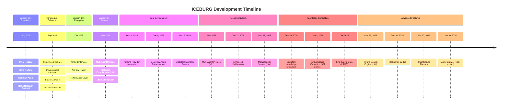

# ICEBURG Development Timeline - Visual Diagram

**Project Duration:** August 2025 - January 2026 (6 months / ~180 days)

---

## Complete Timeline Visualization



---

## Detailed Milestone Timeline

```
┌─────────────────────────────────────────────────────────────────────────────┐
│                    ICEBURG DEVELOPMENT TIMELINE                             │
│              August 2025 - January 2026 (6 months / ~180 days)             │
├─────────────────────────────────────────────────────────────────────────────┤
│                                                                             │
│  AUGUST 2025          SEPTEMBER 2025         OCTOBER 2025                  │
│  ──────────            ─────────────          ──────────                    │
│                                                                             │
│  [Aug]                [Sep]                  [Oct]                          │
│  v1.0 Foundation      v2.0 Enhanced         v3.0 Enterprise                │
│  • Core Platform      • Swarm Architecture  • Unified Interface            │
│  • Secretary Agent    • Physiological       • AGI Civilization             │
│  • Research Protocol  • Business Mode       • Performance Layer           │
│                       • Visual Generation   • Enterprise Features         │
│                                                                             │
│  NOVEMBER 2025                    DECEMBER 2025              JANUARY 2026│
│  ─────────────                    ─────────────              ────────────  │
│                                                                             │
│  [Nov]                            [Dec 1]                    [Jan 1]        │
│  v3.1 Research                    Ollama Integration        Encyclopedia   │
│  • Multi-Agent                    • Local LLM Support       Expansion      │
│  • Encyclopedia (233)             • Provider Layer          • 337 entries  │
│  • Ollama                          • Model Switching         • 30+ cats     │
│                                                                             │
│                                   [Dec 5]                    [Jan 20]       │
│                                   Secretary Agent            COLOSSUS       │
│                                   • AGI Capabilities         • Enterprise   │
│                                   • Memory Integration       • Graph DB     │
│                                                                             │
│                                   [Dec 7]                    Matrix         │
│                                   Hallucination System       • 1.5M entities│
│                                   • Detection Middleware     • Relationships│
│                                   • Emergence Tracking                      │
│                                                                             │
│                                   [Nov-Dec]                                 │
│                                   Multi-Agent Protocol                      │
│                                   • Surveyor                                │
│                                   • Dissident                               │
│                                   • Synthesist                              │
│                                   • Oracle                                  │
│                                                                             │
│                                   [Dec 22]                                  │
│                                   Documentation                             │
│                                   • 48+ files organized                     │
│                                   • Master index                            │
│                                                                             │
│                                   [Dec 23]                                  │
│                                   Metacognition (v3.4)                      │
│                                   • Semantic Alignment                      │
│                                   • Contradiction Detection                 │
│                                   • Quarantine System                       │
│                                                                             │
│                                   [Dec 29]                                  │
│                                   Hybrid Search (v3.6)                      │
│                                   • BM25 + Semantic                         │
│                                   • Neural Reranking                        │
│                                   • Web Integration                        │
│                                                                             │
│                                   [Dec 30]                                  │
│                                   Knowledge Extraction                      │
│                                   • 100+ topics                            │
│                                   • Auto-extraction                         │
│                                   • Metadata tracking                       │
│                                                                             │
│                                   [Dec 2025]                                │
│                                   Fine-Tuning Data                          │
│                                   • 2.7MB generated                        │
│                                   • Agent-specific sets                    │
│                                                                             │
└─────────────────────────────────────────────────────────────────────────────┘
```

---

## Generated Artifacts Timeline

```
┌─────────────────────────────────────────────────────────────────────────────┐
│                    GENERATED ARTIFACTS OVER TIME                             │
├─────────────────────────────────────────────────────────────────────────────┤
│                                                                             │
│  Nov 30:  [████████░░░░░░░░░░░░░░░░░░░░░░░░░░░░░░░░░░░░░░░░░░░░] 215 entries│
│  Dec 30:  [████████████████████████████████████████████████████] 100+ topics│
│  Jan 1:   [████████████████████████████████████████████████████] 337 entries│
│                                                                             │
│  Knowledge Base Growth:                                                    │
│  • Nov 30: 215 entries (440KB)                                            │
│  • Jan 1:  337 entries (660KB)                                            │
│  • Growth: +56.7% in 32 days                                              │
│                                                                             │
│  Training Data:                                                           │
│  • Dec 2025: 2.7MB generated                                             │
│  • 4 agent-specific datasets                                              │
│  • Quality assessment data                                                │
│                                                                             │
│  Intelligence Tracking:                                                    │
│  • 30+ emergence events logged                                           │
│  • Pattern analysis data                                                  │
│  • Breakthrough discoveries (3)                                          │
│                                                                             │
└─────────────────────────────────────────────────────────────────────────────┘
```

---

## System Evolution Timeline

```
┌─────────────────────────────────────────────────────────────────────────────┐
│                    SYSTEM EVOLUTION METRICS                                 │
├─────────────────────────────────────────────────────────────────────────────┤
│                                                                             │
│  Codebase Growth:                                                          │
│  Nov 30:  [████████████████████░░░░░░░░░░░░░░░░░░░░░░░░░░░░░░░░] ~200 modules│
│  Jan 20:  [████████████████████████████████████████████████████] 314 modules│
│                                                                             │
│  Agent Development:                                                        │
│  Nov 30:  [████████████░░░░░░░░░░░░░░░░░░░░░░░░░░░░░░░░░░░░░░░░] ~30 agents │
│  Jan 20:  [████████████████████████████████████████████████████] 45+ agents │
│                                                                             │
│  Data Files Generated:                                                     │
│  Nov 30:  [████░░░░░░░░░░░░░░░░░░░░░░░░░░░░░░░░░░░░░░░░░░░░░░░░] ~50 files  │
│  Jan 20:  [████████████████████████████████████████████████████] 359 files  │
│                                                                             │
│  Documentation:                                                            │
│  Nov 30:  [██░░░░░░░░░░░░░░░░░░░░░░░░░░░░░░░░░░░░░░░░░░░░░░░░░░] Minimal    │
│  Jan 20:  [████████████████████████████████████████████████████] 200+ files │
│                                                                             │
└─────────────────────────────────────────────────────────────────────────────┘
```

---

## Version Release Timeline

```
Version 1.0.0 ────────────────────────────────────────────────────────────────
  Aug 2025 [PROJECT START]
  • Initial Release
  • Core ICEBURG platform
  • Secretary Agent
  • Basic multi-agent deliberation
  • Foundation systems

Version 2.0.0 ────────────────────────────────────────────────────────────────
  Sep 2025
  • Enhanced Swarm Architecture (6 types)
  • Physiological Interface
  • Business Mode
  • Visual Generation

Version 3.0.0 ────────────────────────────────────────────────────────────────
  Oct 2025
  • Unified Interface Layer
  • AGI Civilization System
  • Performance Layer
  • Enterprise Features

Version 3.1.0 ────────────────────────────────────────────────────────────────
  Nov 2025
  • Multi-Agent Research System
  • Celestial Encyclopedia (233 entries)
  • Ollama Integration

Version 3.2.0 ────────────────────────────────────────────────────────────────
  Dec 19, 2025
  • Secretary Verbose Output Fix
  • System Prompt Optimization

Version 3.3.0 ────────────────────────────────────────────────────────────────
  Dec 21, 2025
  • Documentation Reorganization (48+ files)
  • README Rewrite
  • Current State Documentation

Version 3.4.0 ────────────────────────────────────────────────────────────────
  Dec 23, 2025
  • Metacognition System
  • Quarantine System
  • Safety Audit
  • Complete Feature Reference

Version 3.5.0 ────────────────────────────────────────────────────────────────
  Dec 27, 2025
  • M4 Optimization Strategy
  • Fine-Tuning Manager
  • Deep Intelligence Analysis

Version 3.6.0 ────────────────────────────────────────────────────────────────
  Dec 29, 2025
  • Secretary V2 Hybrid Search
  • V2 Intelligence Bridge
  • Uncensored Model Pool

Current: Version 3.6.0+ (Jan 2026)
  • COLOSSUS Platform
  • Matrix Crawler
  • Enterprise Intelligence
```

---

## Key Achievements by Phase

### Phase 1: Foundation (Nov 30, 2025)
- ✅ Complete codebase initialization
- ✅ Celestial Encyclopedia (215 entries)
- ✅ Deployment infrastructure

### Phase 2: Core Development (Dec 1-7, 2025)
- ✅ Local LLM integration
- ✅ Enhanced agent capabilities
- ✅ System-wide safety middleware

### Phase 3: Research System (Nov-Dec 2025)
- ✅ Multi-agent protocol implementation
- ✅ Enhanced deliberation system
- ✅ Metacognition framework

### Phase 4: Knowledge Generation (Dec 2025 - Jan 2026)
- ✅ Automatic knowledge extraction
- ✅ Encyclopedia expansion (337 entries)
- ✅ Training data generation (2.7MB)

### Phase 5: Advanced Features (Dec 29-30, 2025)
- ✅ Hybrid search engine
- ✅ Intelligence integration
- ✅ Citation system

### Phase 6: Enterprise Platform (Jan 2026)
- ✅ COLOSSUS enterprise platform
- ✅ Graph database integration
- ✅ Entity relationship mapping (1.5M entities)

---

## Cumulative Output Metrics

```
┌─────────────────────────────────────────────────────────────────────────────┐
│                    CUMULATIVE OUTPUT METRICS                                │
├─────────────────────────────────────────────────────────────────────────────┤
│                                                                             │
│  Knowledge Bases:                                                          │
│  • Celestial Encyclopedia: 337 entries (15,492 lines)                      │
│  • Secretary Knowledge: 100+ topics (532KB)                               │
│  • Gnosis Knowledge: Accumulated (76KB)                                   │
│                                                                             │
│  Training Data:                                                            │
│  • Fine-tuning datasets: 2.7MB                                           │
│  • Agent training: 4 files                                               │
│  • Quality data: Included                                                │
│                                                                             │
│  Intelligence Tracking:                                                   │
│  • Emergence events: 30+ logged                                         │
│  • Breakthrough discoveries: 3 tracked                                    │
│  • Pattern analysis: Active                                              │
│                                                                             │
│  System Assets:                                                           │
│  • Python modules: 314                                                   │
│  • Specialized agents: 45+                                              │
│  • Total agents: 61                                                      │
│  • Data files: 359                                                       │
│  • Documentation: 200+ files                                              │
│                                                                             │
│  Total Data Generated: ~8MB                                              │
│                                                                             │
└─────────────────────────────────────────────────────────────────────────────┘
```

---

**Document Version:** 1.0  
**Last Updated:** January 2025
