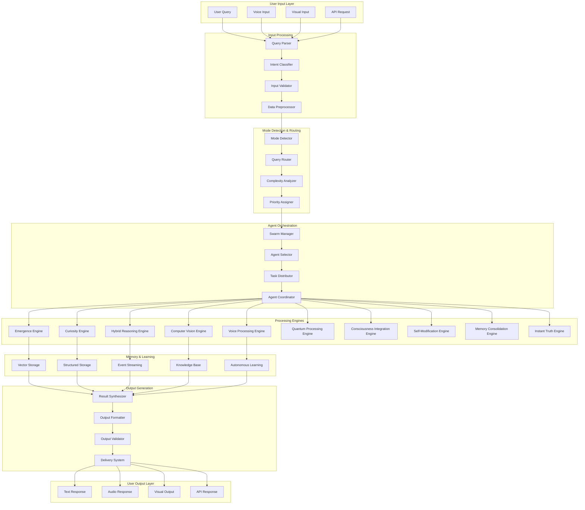
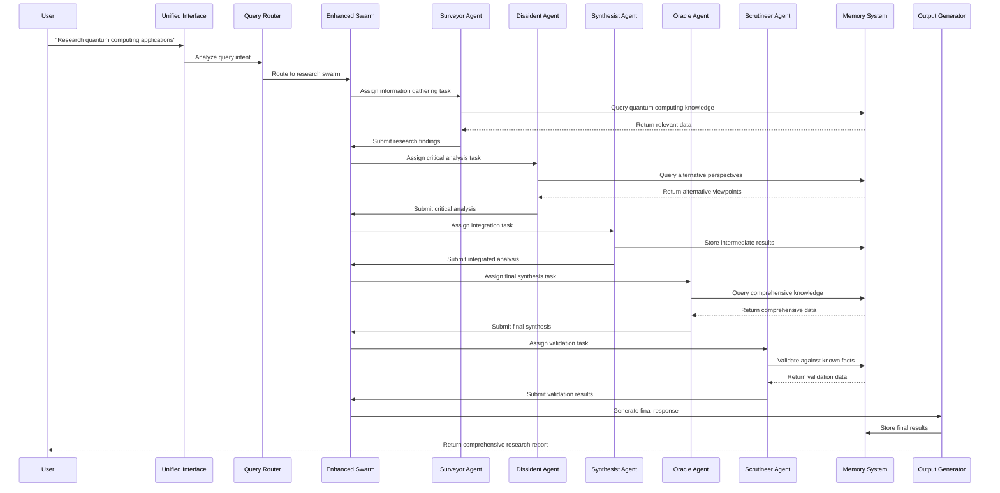
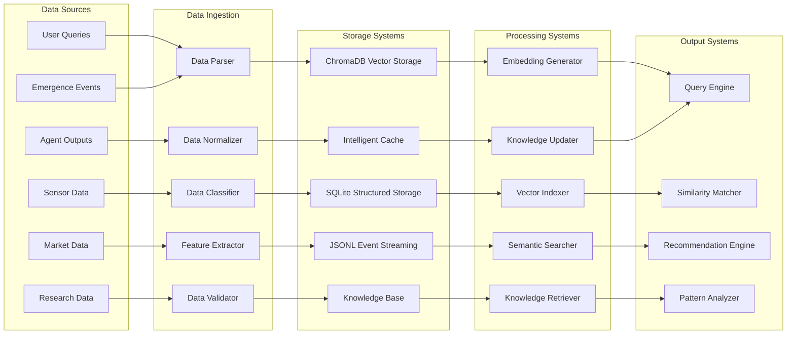
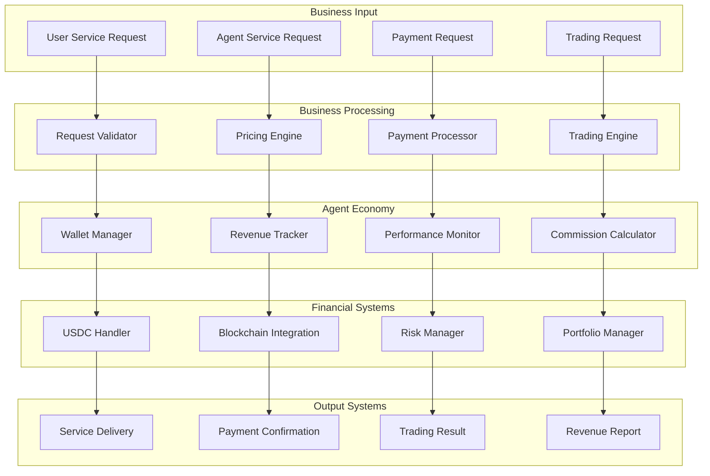
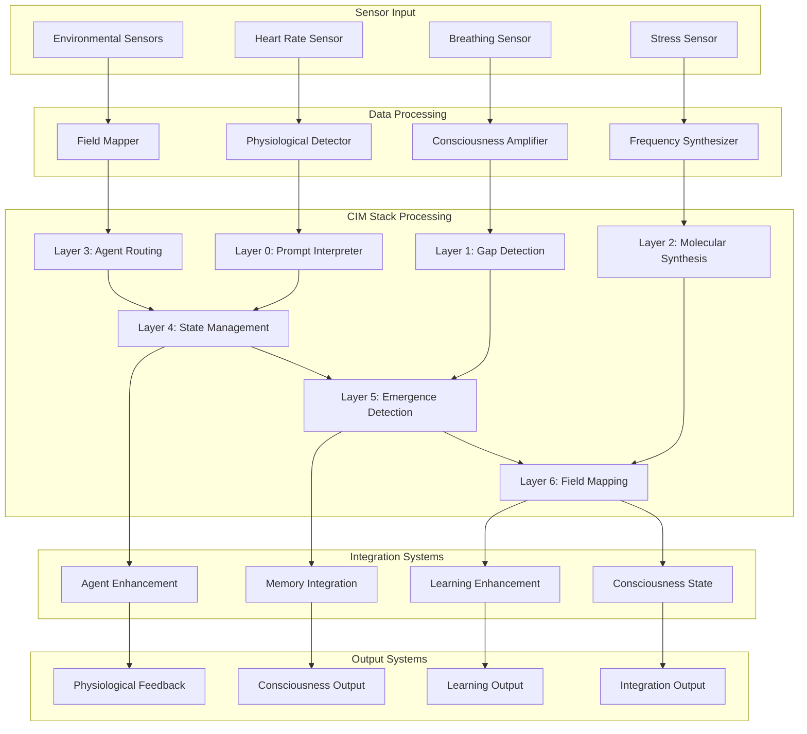
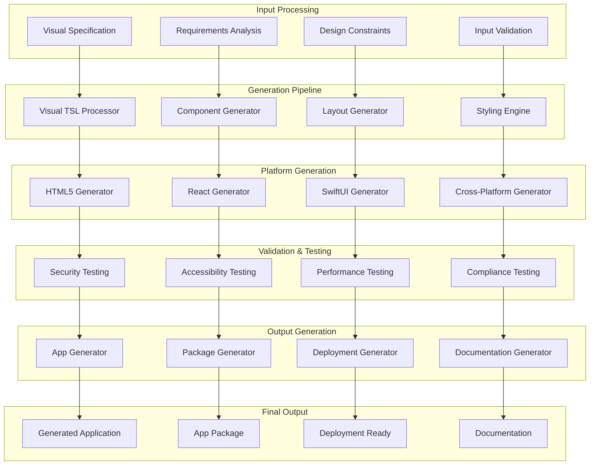
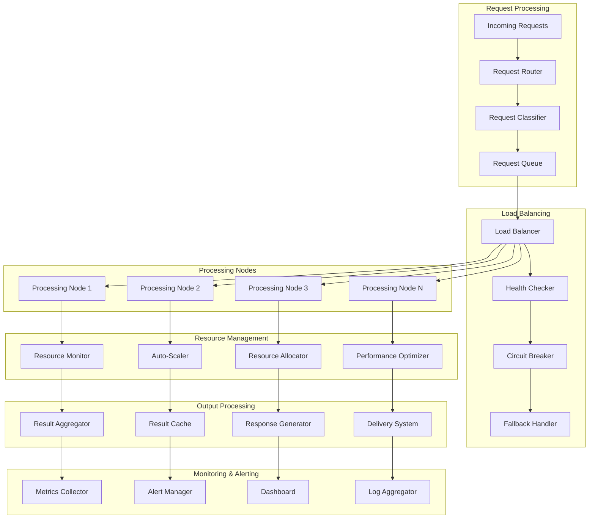
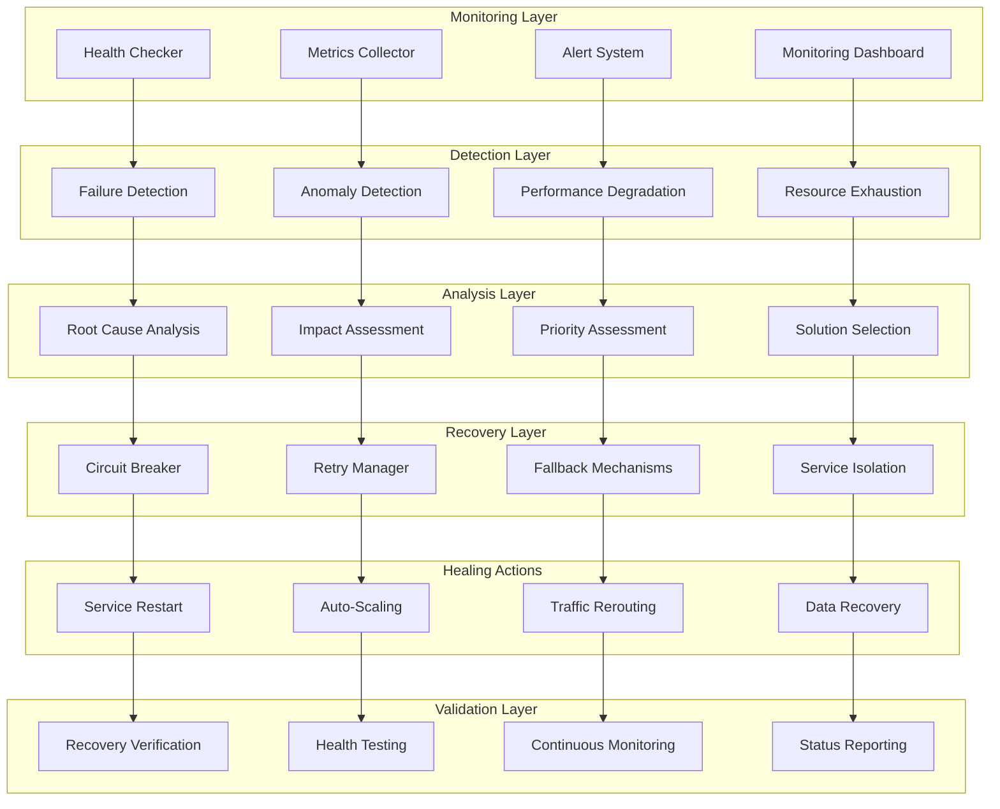
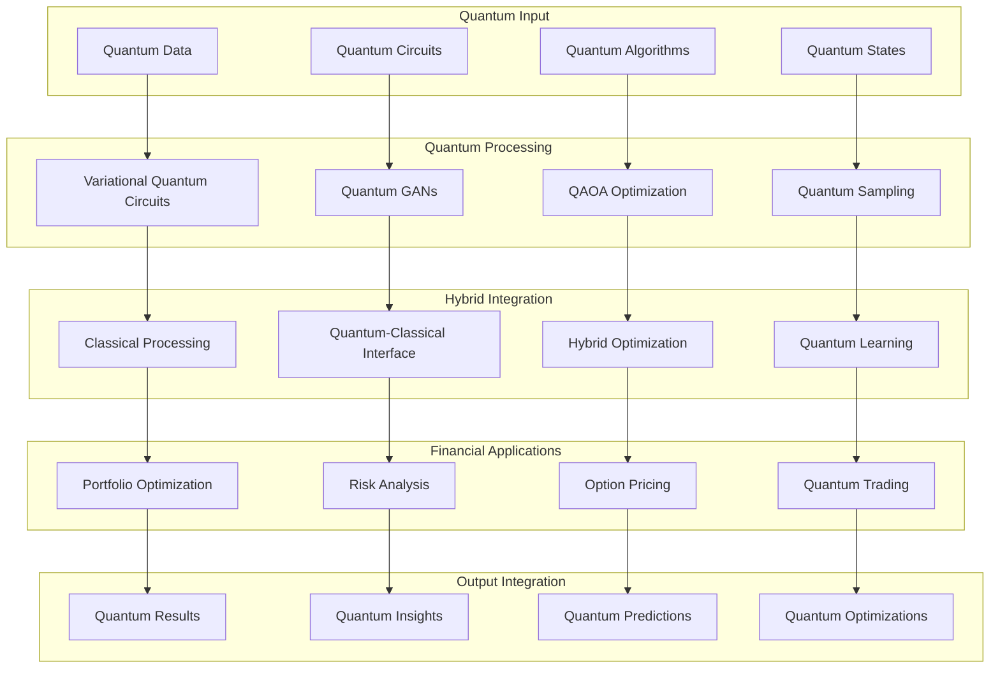

# ICEBURG System Flow Diagrams

## Complete System Flow

### End-to-End Query Processing Flow

### Agent Communication Flow

### Memory System Data Flow

### Business System Flow

### Physiological System Flow

### Visual Generation Flow

### Infrastructure Scaling Flow

### Self-Healing System Flow

### Quantum Processing Integration Flow

---

**Document Version**: 3.0.0  
**Last Updated**: January 2025  
**Maintained By**: Praxis Research & Engineering Inc.
