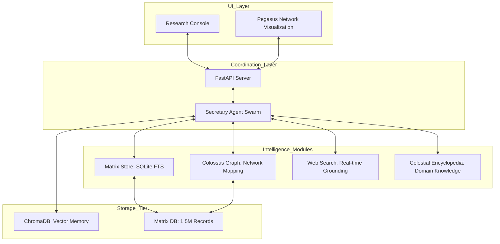

# ICEBURG Architectural Overview

## Introduction

ICEBURG is a multi-agent research platform designed for local-first intelligence processing, deliberation, and complex entity mapping. The platform's core identity centers on the **Secretary Agent Swarm**—a group of specialized LLM-driven agents that coordinate to synthesize large datasets into actionable research.

## High-Level System Design

ICEBURG's architecture is built around a central coordination layer that connects local inference to specialized data tiers.

## Core Functional Tiers

### 1. The Reasoning Swarm (Core)
The heart of ICEBURG is the multi-agent deliberation protocol. It utilizes a rotating pool of local models (via Ollama) to execute research workflows:
- **Surveyor**: Scans available data and performs initial grounding.
- **Dissident**: Challenges findings and detects logical contradictions.
- **Synthesist**: Merges multiple viewpoints into a coherent narrative.
- **Oracle**: Final pass for deep context and metaphysical alignment.

### 2. High-Fidelity Network Intelligence (Pegasus/Colossus)
As a modular extension, ICEBURG includes the **Colossus Intelligence Platform**. This tier is responsible for high-speed Investigative graph traversal and mapping:
- **MatrixStore**: Provides 100% data coverage search over 1.5M+ entities using SQLite FTS.
- **Colossus Graph**: Manages complex relationship mappings (Edges) for network discovery.
- **Pegasus UI**: A dedicated visualization engine (extension) that renders the Colossus network data in a real-time, interactive graph.

### 3. Grounding & Memory Layer
- **Unified Memory**: A singleton storage client managing ChromaDB for semantic retrieval.
- **Hybrid Search**: Orchestrates between vector, lexical, and web search results to find the highest-quality context.

## Modularity & Extensibility
ICEBURG is designed such that advanced modules like Pegasus or the Finance Intelligence bridge can be integrated without redefining the platform's core research identity. Each extension plugs into the standard agent toolset, allowing the Secretary agent to leverage new data formats as they become available.
