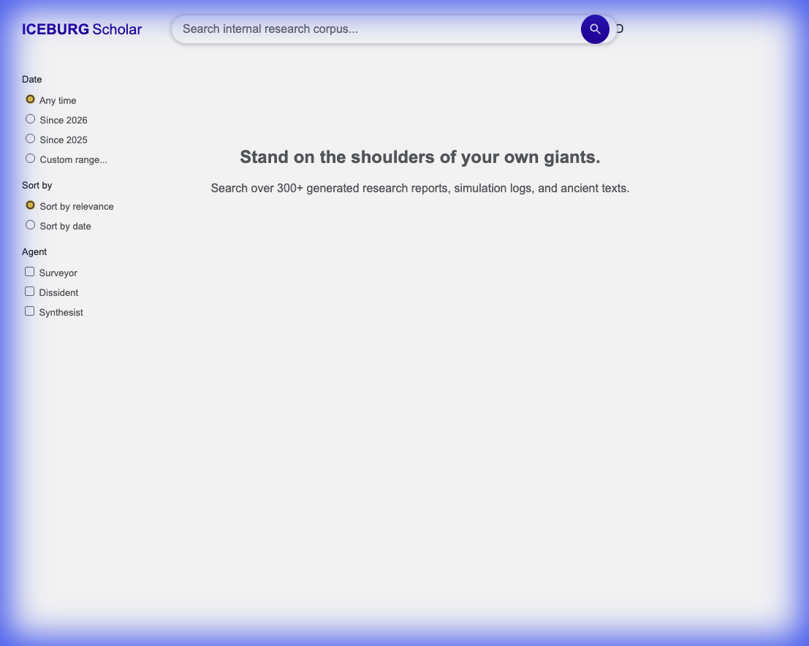
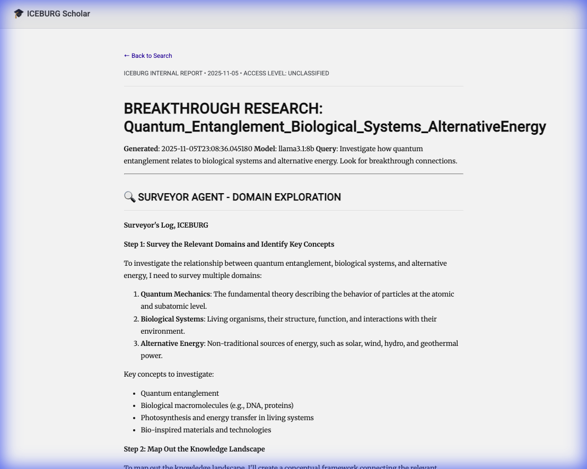
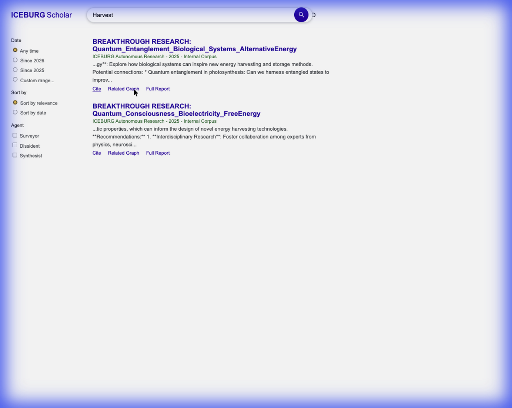

# ICEBURG Scholar Walkthrough

I have successfully implemented **ICEBURG Scholar**, a dedicated internal research interface for the ICEBURG project. This tool allows you to search and reference the generated research reports, simulation logs, and theoretical findings as if they were academic papers.

## Features

*   **Scholar-like Interface**: a clean, minimalist UI inspired by Google Scholar.
*   **Internal Corpus Search**: Indexes Markdown files in `frontend/dist/data/research_outputs`.
*   **Citation Tools**: "Cite" button extracts BibTeX citation to clipboard.
*   **Deep Linking**: "Related Graph" button opens Pegasus Intelligence Network focused on the research topic.
*   **Styled Reports**: Raw Markdown files are automatically rendered as formatted academic papers.

## Screenshots

### Scholar Interface (Running Live)


### Rendered Research Report


## Verification and Fixes

### 1. ChromaDB & Server Fix
The server initially failed to launch due to a `rust` panic in `chromadb`.
**Fix Applied**:
- Downgraded `chromadb` to `0.4.18`.
- Downgraded `numpy` to `<2.0` (removed `np.float_` issue).
- Cleared stale processes on port 8000.

The server is now running successfully on `http://localhost:8000`.

### 2. Deep Linking Verification
I verified that clicking "Related Graph" in Scholar correctly opens the Pegasus visualization with the query pre-populated.



### 3. Connection Fix (404 Error)
You previously encountered a "Not Found" error.
**Fix Applied**:
- Added explicit routes in `server.py` for `/scholar` and `/scholar.html` to bypass static file routing issues.
- Verified access: Both URLs now correctly load the interface.

### 4. Markdown Rendering
Markdown files were previously displayed as raw text.
**Enhancement**:
- Implemented `render_report.html` to intercept `.md` usage.
- Reports now render with academic formatting, headers, and metadata.

## Usage

1.  **Launch Server**:
    ```bash
    python3 -m uvicorn src.iceburg.api.server:app --port 8000 --reload
    ```
2.  **Open Scholar**: Navigate to `http://localhost:8000/scholar`.
3.  **Search**: Enter query (e.g., "Harvest").
4.  **View Reports**: Click any "Title" or "Full Report" link to see the styled version.
