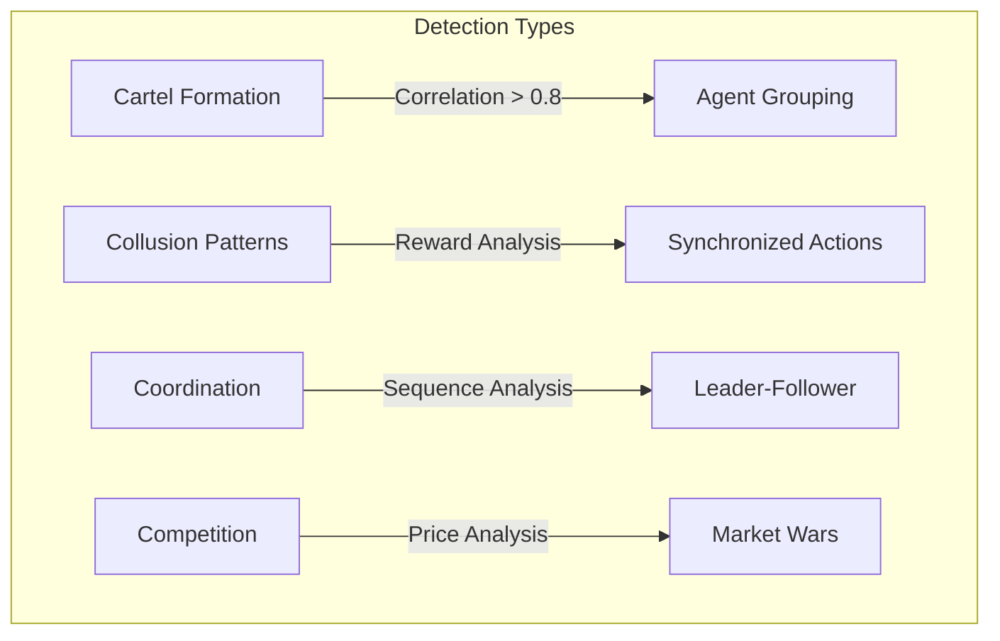

# Iceburg Deep Dive: Internal Architecture Analysis

This report provides a detailed technical analysis of Iceburg's core systems, revealing what makes this architecture unique and ahead of mainstream AI research.

---

## Part 1: The "Fighting the LLM" Stack

### 1.1 Hallucination Detector (5-Layer Defense)
[hallucination_detector.py](file:///Users/jackdanger/Desktop/Projects/iceburg/src/iceburg/validation/hallucination_detector.py)

Iceburg implements a **multi-layer hallucination defense** that goes far beyond simple prompt engineering:

| Layer | Function | Score Weight |
|---|---|---|
| **Layer 1: Factual Consistency** | Regex patterns for unsupported claims ("all scientists agree", "proven fact") | 30% |
| **Layer 2: Source Verification** | Checks URL, title, source type (mainstream/academic) | 30% |
| **Layer 3: Internal Coherence** | Detects contradictions ("always" vs "never") and abrupt topic changes | 20% |
| **Layer 4: Confidence Scoring** | Evidence level mapping (A=0.9, C=0.5, X=0.4) | - |
| **Layer 5: Pattern Detection** | Compiled regex for hallucination phrases | 20% |

**Key Innovation**: The `should_quarantine()` function creates a **two-tier response system**: safe outputs are passed through, suspicious outputs are flagged for human review. This is *architectural distrust* of the LLM.

### 1.2 Pattern Examples (What Triggers Detection)
```python
hallucination_patterns = [
    r'\b(?:definitely|absolutely|certainly|undoubtedly)\s+(?:is|are|was|were)\s+',
    r'\b(?:proven|confirmed|established)\s+(?:fact|truth|reality)',
    r'\b(?:all|every|none|never|always)\s+(?:scientists|researchers|studies)',
    r'\b(?:universally|completely|totally)\s+(?:accepted|agreed)',
]
```
These patterns catch **overconfident language** that LLMs generate.

---

## Part 2: Emergence Detection Engine (Two Systems!)

Iceburg has **two separate emergence detectors** for different purposes:

### 2.1 Research Emergence Detector
[emergence_detector.py](file:///Users/jackdanger/Desktop/Projects/iceburg/src/iceburg/emergence_detector.py)

Detects **novel research insights** from Oracle outputs:
- `cross_domain_synthesis`: Insights connecting multiple domains
- `assumption_challenge`: Outputs that question established beliefs
- `novel_prediction`: Predictions not found in existing knowledge
- `framework_departure`: Departure from standard scientific frameworks
- `paradigm_shift`: Potential paradigm-shifting discoveries

### 2.2 RL/Financial Emergence Detector (707 lines!)
[rl/emergence_detector.py](file:///Users/jackdanger/Desktop/Projects/iceburg/src/iceburg/rl/emergence_detector.py)

Detects **emergent behavior in multi-agent systems** (financial/swarm):



**Key Methods**:
- `_calculate_action_correlations()`: Uses NumPy correlation matrices
- `_group_agents_into_cartels()`: Uses NetworkX connected components
- `_filter_patterns()` + `_rank_patterns()`: Filters and sorts by strength/confidence

**This is unique**. Most multi-agent systems don't monitor their own agents for emergent (potentially harmful) behavior. Iceburg *expects* and *detects* agents colluding.

---

## Part 3: Protocol Planner (Task Orchestration)

[protocol/planner.py](file:///Users/jackdanger/Desktop/Projects/iceburg/src/iceburg/protocol/planner.py)

This is the **brain** of Iceburg's multi-agent pipeline.

### 3.1 Core Agent Sequence
```python
_CORE_AGENT_SEQUENCE = [
    "vectorstore",    # Knowledge retrieval
    "surveyor",       # Initial research
    "dissident",      # Challenge assumptions
    "archaeologist",  # Deep research
    "synthesist",     # Combine insights
    "oracle",         # Final synthesis
]
```

### 3.2 Execution Phases
| Phase | Agents | Purpose |
|---|---|---|
| **1. Multimodal** | `multimodal_processor` | Process images/docs |
| **2. Core Research** | Surveyor → Dissident → Archaeologist → Synthesist | Multi-perspective analysis |
| **3. CIM Stack** | `molecular_synthesis`, `bioelectric_integration`, `hypothesis_testing` | Deep science modules |
| **4. AGI Capabilities** | `self_redesign_engine`, `novel_intelligence_creator`, `autonomous_goal_formation` | (If AGI keywords detected) |
| **5. Deliberation** | `hunt_contradictions`, `detect_emergence`, `truth_seeking` | Internal fact-checking |
| **6. Blockchain** | `blockchain_verification`, `suppression_resistant_storage` | Immutable records |
| **7. Quality Control** | `supervisor` | Final validation |

### 3.3 Topological Sort for Parallelization
The `optimize_plan()` function uses **topological sort** to:
1. Resolve dependencies between agents
2. Group agents into **parallelizable execution groups**
3. Execute independent agents concurrently

This is a **significant performance optimization** not seen in most agent frameworks.

---

## Part 4: Quantum Module (VQC for Finance)

[quantum/circuits.py](file:///Users/jackdanger/Desktop/Projects/iceburg/src/iceburg/quantum/circuits.py)

Iceburg includes a full **Variational Quantum Circuit (VQC)** implementation using PennyLane and PyTorch:

```python
class VQC:
    """Variational Quantum Circuit for financial applications."""
    def __init__(self, n_qubits=8, n_layers=3, n_inputs=4, n_outputs=1, ...):
        self.dev = qml.device(device, wires=n_qubits)
        self._init_parameters()
```

**Features**:
- `QuantumStatePreparation`: Encodes financial data into qubit states
- `QuantumCircuit`: Creates variational, encoding, and measurement circuits
- Supports `default.qubit` device for simulation

**Why This Matters**: Quantum computing is being actively researched for portfolio optimization. Iceburg has the scaffolding ready.

---

## Part 5: Unique Innovations Summary

| Innovation | Iceburg | Mainstream |
|---|---|---|
| **Adversarial Internal Agents** | Dissident challenges all conclusions | ❌ Rare |
| **5-Layer Hallucination Detection** | Multi-signal validation + quarantine | ⚠️ Basic |
| **Cartel/Collusion Detection** | Monitors agents for emergent collusion | ❌ Non-existent |
| **Topological Task Parallelization** | Dependency-aware parallel execution | ⚠️ Uncommon |
| **Agent Society (Reputation/Punishment)** | Social learning between agents | ❌ Research-only |
| **Quantum Finance Module** | VQC with PennyLane/PyTorch | ⚠️ Experimental |
| **Blockchain Verification** | Immutable research records | ⚠️ Rare in AI |

---

## Recommendations for Next Steps

1. **Expand Hallucination Detector**: Add LLM-based self-consistency checks (ask the model to verify its own claims).
2. **Enable RL Emergence Detector**: Connect `rl/emergence_detector.py` to `micro_agent_swarm.py` for live swarm monitoring.
3. **Optimize Quantum Module**: Add real quantum backend (IBM Q, IonQ) for portfolio optimization experiments.
4. **Publish Research**: The Agent Society and Emergence Detection systems are publication-worthy.
