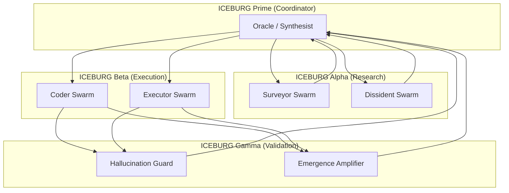

# Iceburg Novelty & AI Landscape Research Report

This report synthesizes Iceburg's unique position in the AI landscape, comparing its architecture to mainstream approaches, and summarizing underground, Chinese, and patent developments.

## Part 1: What Makes Iceburg Novel?

Iceburg implements several concepts that are **rare or absent in mainstream AI research** but are now becoming "hot topics".

### 1.1 Adversarial Multi-Agent "Truth-Finding"
| Iceburg Feature | Mainstream Equivalent | Novelty |
|---|---|---|
| **Dissident Agent** (Challenges assumptions) | None (Most systems seek consensus) | 🔥 **Unique** |
| **Surveyor → Dissident → Synthesist → Oracle** pipeline | Simple RAG or single-agent | 🔥 **Rare** |
| [GlobalAgentMiddleware](file:///Users/jackdanger/Desktop/Projects/iceburg/src/iceburg/middleware/global_agent_middleware.py) for hallucination interception | Some LangChain guards | ⚡ **Advanced** |

**Key Insight**: Iceburg's "Dissident" is an *adversarial internal agent*, similar to research into **LLM Self-Correction** where models generate verification questions and challenge their own output. This is now a [hot topic in 2024-2025 research](https://aclanthology.org/).

### 1.2 "Fighting the LLM" (Hallucination & Alignment War)
Iceburg doesn't just *use* an LLM — it **actively distrusts and corrects** it.

**Iceburg's Anti-Hallucination Stack:**
1.  `HallucinationDetector`: Validates outputs against known truth.
2.  `EmergenceDetector`: Flags "novel" insights for human review (Quarantine).
3.  `GlobalAgentMiddleware`: **Intercepts ALL agent outputs** before returning to user.

**Underground Parallel**: The hacker/jailbreak community (WormGPT, KawaiiGPT) focuses on *exploiting* LLM trust. Iceburg does the *inverse*: it *enforces distrust systemically*.

### 1.3 Agent Civilization & Social Learning
[agent_society.py](file:///Users/jackdanger/Desktop/Projects/iceburg/src/iceburg/civilization/agent_society.py) implements:
- **Reputation Systems**: Agents track each other's "success scores".
- **Imitation of Successful Peers**: Agents mimic top performers.
- **Social Norms & Punishment**: Agents can "punish" low-quality peers.
- **Cooperation Strategies**: Agents choose between Conservative, Balanced, Exploratory, & Aggressive.

**Novelty**: This is **ahead of mainstream research**. The 2024 [SwarmSys Framework (arXiv)](https://arxiv.org/abs/2411.04693) proposes similar "pheromone-inspired" self-organization, but Iceburg's implementation is *more granular* with explicit reputation, punishment, and norm-enforcement.

### 1.4 Micro-Agent Swarms
[micro_agent_swarm.py](file:///Users/jackdanger/Desktop/Projects/iceburg/src/iceburg/micro_agent_swarm.py) implements:
- **Specialized Tiny Models**: Different 1B-3B models for different tasks (Summarizer, Validator, Researcher).
- **Priority Queue Coordination**: Tasks distributed to best-fit agent.
- **Parallel Execution**: Up to 6 agents running simultaneously.

**Why This Matters Now**: DeepSeek's distillation strategy (R1 → R1-8B → R1-1.5B) proves that *smaller models can be specialized*. Iceburg's architecture *anticipates* this by designing for a swarm of *specialized* tiny models rather than one general-purpose large model.

---

## Part 2: Underground & Hacker AI News

### 2.1 Key Trends (Dec 2024)
| Trend | Summary |
|---|---|
| **50% Surge in "Jailbreak" Chatter** | Hacker forums saw a 50% increase in jailbreak discussions in 2024. |
| **WormGPT / KawaiiGPT** | Jailbroken LLMs designed for malicious code generation sold on dark web. |
| **JailbreakBench** | Open-source benchmark for tracking jailbreak success/defense. |
| **Model Context Protocol (MCP)** | Anthropic's standard for AI tool connectivity (Nov 2024); community servers emerging. |

### 2.2 Iceburg Relevance
Iceburg's `GlobalAgentMiddleware` and `HallucinationDetector` are essentially "anti-jailbreak" layers *for the agents themselves*. If an agent tries to output something unverified or harmful, the middleware catches it.

---

## Part 3: Chinese AI Leadership (DeepSeek & Qwen)

### 3.1 DeepSeek's Distillation Revolution
- **DeepSeek-R1**: 671B MoE model with "o1-level" reasoning, open-sourced Jan 2025.
- **Distillation**: R1 → R1-Distill-Llama-8B, R1-Distill-Qwen-32B, R1-Distill-1.5B. All open-source.
- **Cost**: Trained for < $6M (vs. $100M+ for GPT-4).

**Iceburg Opportunity**: Iceburg's `TrainManager` can directly replicate this distillation process *locally* on M4, using Iceburg's own data to create an "Iceburg-R1-3B".

### 3.2 Alibaba Qwen's Open-Source Dominance
- **Qwen 2.5 / Qwen 3**: Leading benchmarks for coding, math, multilingual.
- **QwQ-32B-Preview**: First open-source *reasoning* model (Nov 2024).
- **600M+ Downloads**: Qwen models are the most-downloaded on HuggingFace.

**Iceburg Opportunity**: Qwen 2.5 32B is already configured as Iceburg's "Oracle" tier. The Qwen 3 (Apache 2.0) series could be a future upgrade.

---

## Part 4: New AI Patents & Anomalies (2024-2025)

### 4.1 Key Breakthroughs Being Patented
| Area | Innovation |
|---|---|
| **Anomaly Detection** | LLMs using proximal policy optimization for log-based anomaly detection. |
| **AI Robotics** | Samsung's delivery robots, Tesla Optimus. |
| **Healthcare AI** | FDA-approved AI for autism diagnosis (microbial biomarkers). |
| **Federated/Swarm Learning** | Blockchain-secured Swarm Learning (SL) to replace Federated Learning. |

### 4.2 Anomalies & Gaps
- **Decline in Granted Patents**: Despite high filings, granted patents declined in 2024. Indicates stricter examination or companies hoarding for "core" IP vs. volume.
- **Financial Sector AI**: Capital One and Bank of America are now **top 10 AI patent holders**, not traditional tech companies. This signals AI is becoming "table stakes" across all industries.

---

## Part 5: The Grander Plan (Multi-Iceburg)

Based on Iceburg's architecture, the "grander plan" for a multi-Iceburg system could look like:

**Key Elements**:
1.  **Iceburg Prime**: The "truth-seeking" brain. Uses the Oracle model.
2.  **Iceburg Alpha/Beta/Gamma**: Specialized swarm clusters for research, code execution, and validation. Use tiny models (3B).
3.  **Social Learning Network**: Agent Societies can span *across* Iceburgs, sharing "reputation" and "norms".

---

## Summary: What We Can Learn from Iceburg

| Iceburg Concept | What We Learn | Next Step |
|---|---|---|
| Dissident Agent | Adversarial internal reasoning *improves* accuracy | Expand to multi-round debates |
| Social Learning | Agents with reputation/punishment evolve better strategies | Run longer simulations |
| Swarm of Tiny Models | DeepSeek proved distillation works; Iceburg is ready for it | Implement distillation with `TrainManager` |
| "Fighting the LLM" | Systematic distrust is a valid architecture pattern | Continue developing `GlobalAgentMiddleware` |
